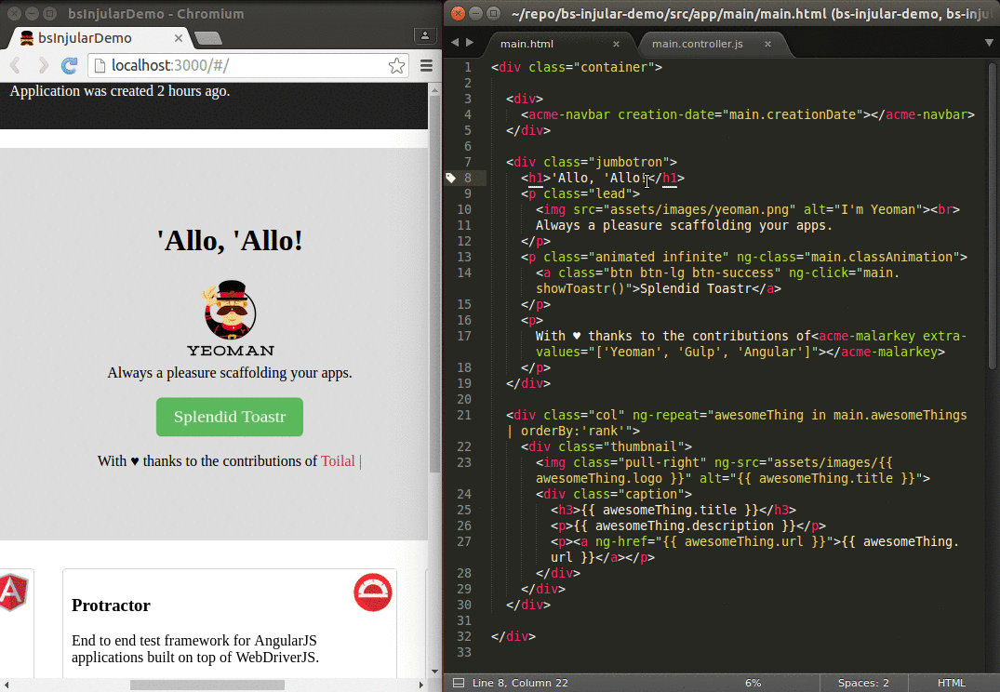

# Injular demo

Demo for [Injular](https://github.com/tfoxy/bs-injular)  
Generated by [generator-gulp-angular](https://github.com/Swiip/generator-gulp-angular)


## Try it

```shell
git clone https://github.com/tfoxy/bs-injular-demo.git
cd bs-injular-demo
npm install && bower install
gulp serve
```

Modify the `*.html` and `*.controller.js` files inside `src/app`
and watch the changes instantly.




## Modified files

The following list include the files that were modified
after using yeoman to generate the project.

* [gulp/server.js](gulp/server.js#L50-L54)
* [gulp/scripts.js](gulp/scripts.js#L13-L18)
* [gulp/watch.js](gulp/watch.js#L26-L32)
